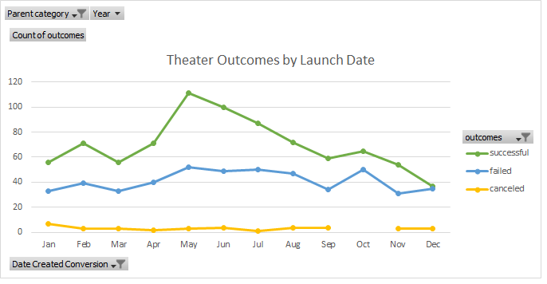
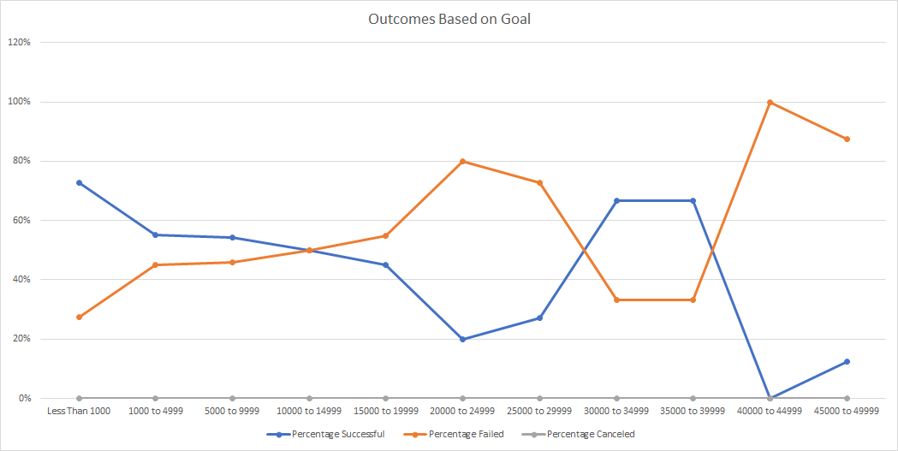

# Performing Analysis on Kickstarter Data to Uncover Trends

## Overview of Project
### Purpose of Project
In this project, I demonstrated my proficiency with various features in excel including: conditional formatting, debugging errors, VLOOKUPs, and creating interactive charts and graphs with pivot charts. To accomplish these goals, I was given a fictional situation and data set of several thousand crowdfunding projects. 
### Background of Project
Louise, an up-and-coming playwright, wants to start a crowd funding campaign to fund her play *FEVER* which she estimates will cost over $10,000. The following report highlights specfic factors that lead to a successful campaign.     

---
### Analysis and Challenges
### Analysis
I organized the data to see if the month the kickstarter launched could impact its success. First, I made the data more detailed by splitting the Category and Subcategory column into two distinct columns. This allowed me to view the wider category of theater and later the narrower subcategory plays. Next, I converted Unix timestamps to identify the launch date. For example, I turned the cell **1434931811** into **06/22/15** using the code =(((J2/60)/60)/24)+DATE(1970,1,1). Finally, I created a pivot table that filtered based on "Parent Category" and "Years." From that pivot table I created the line graph shown below. 

Based on the line graph above, I had the following takeways about theather campaigns:
* May, June, and July respectively had the highest number of successful campaigns 
* October and May respectively had the highest number of failed campaigns 
* December had about as many successful as failed campaigns 

### Challenges 
=COUNTIFS('Raw Data'!$O:$O, "plays",'Raw Data'!$D:$D, ">=1000", 'Raw Data'!$D:$D, "<5000", 'Raw Data'!$F:$F, "successful") 

---
### Results

